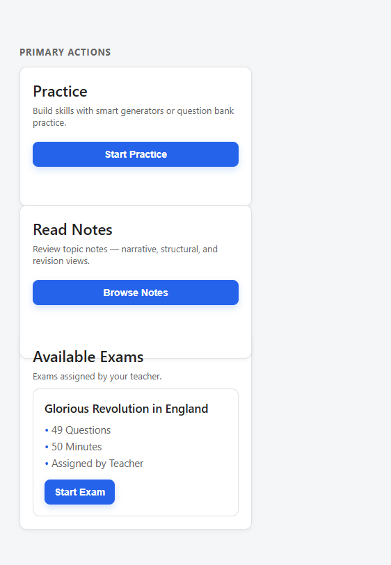

# Dashboard Layout Overlap Fix

**Date:** 30 May 2026  
**Issue:** Read Notes card physically overlaps Available Exams heading (layout bug, not hover)

---

## Root Cause

The overlap was caused by **`.student-action-card { height: 100%; }`** inside a **CSS Grid** container (`.student-primary-actions`).

### DevTools box-model audit (390px mobile)

| Metric | Before (broken) | After (fix) |
|--------|-----------------|-------------|
| `grid-template-rows` | `163px 183px` | `163px 163px` (auto-sized to content) |
| `.student-primary-actions` `clientHeight` | 362px | 342px |
| `.student-primary-actions` `scrollHeight` | **420px** | **342px** (matches client) |
| Read Notes `getBoundingClientRect().bottom` | 515.8px | 437.8px |
| Primary Actions `getBoundingClientRect().bottom` | 457.8px | 437.8px |
| **Overflow below grid container** | **58px** | **0px** |
| **Overlap Read Notes → Exams heading** | **+19px** | **−39px** (clear gap) |

### Why it happened

1. `.card` uses **`box-sizing: content-box`** (default). Card `height` applies to content only; padding and borders add ~38px beyond the computed height.
2. `height: 100%` on grid items made the grid algorithm set row tracks to those **percentage heights** (`163px`, `183px`) instead of the full rendered border-box size (~201px, ~221px).
3. The grid container’s box ended at row track boundaries, but the cards **painted outside** their tracks — 58px of Read Notes extended below `.student-primary-actions`.
4. `.card + .card { margin-top: 20px }` on the second action card added **another 20px** inside row 2, worsening overflow (combined with grid `gap: 16px` this was redundant).

This is **not** caused by `:hover` / `translateY`, negative margins, absolute positioning, or JavaScript.

---

## Exact CSS / HTML

**HTML** (`student-dashboard.html`):

```html
<div class="student-primary-actions mt-10">
  <div class="card student-action-card">…Practice…</div>
  <div class="card student-action-card">…Read Notes…</div>
</div>
<div class="card mt-20">
  <div class="h2">Available Exams</div>
  …
</div>
```

**Broken CSS** (removed):

```css
.student-action-card {
  height: 100%;  /* caused grid row under-sizing + overflow */
}
```

**Contributing global rule:**

```css
.card + .card {
  margin-top: 20px;  /* redundant inside grid; pushed 2nd card past row boundary */
}
```

---

## Fix Applied

**File:** `css/style.css`

```css
.student-primary-actions {
  display: grid;
  grid-template-columns: repeat(auto-fit, minmax(240px, 1fr));
  gap: 16px;
  align-items: stretch;
}

.student-primary-actions .card + .card {
  margin-top: 0;
}
```

- **Removed** `height: 100%` so grid rows size to full card content.
- **Reset** sibling card margin inside the grid; `gap` handles spacing.
- **Kept** `align-items: stretch` so side-by-side cards on tablet/desktop still equalize height via normal grid stretch (verified at 768px).

### Verification checklist

| Check | Result |
|-------|--------|
| Primary Actions expands to full rendered height of both cards | ✅ `scrollHeight === clientHeight` |
| Available Exams starts after Primary Actions ends | ✅ 20px `mt-20` gap between sections |
| No negative margins | ✅ |
| No `translateY` for layout | ✅ |
| No card extends outside its parent | ✅ Read Notes bottom === grid container bottom |

---

## Before / After Screenshots

390px mobile viewport, same dashboard markup, DevTools device emulation:

| | Screenshot |
|---|------------|
| **Before** |  |
| **After** |  |

---

## Related

The earlier touch/hover fix (scoped `.card:hover` to fine pointers) addressed a separate 2px lift on tap. This fix addresses the **structural** grid overflow that remained regardless of interaction state.
