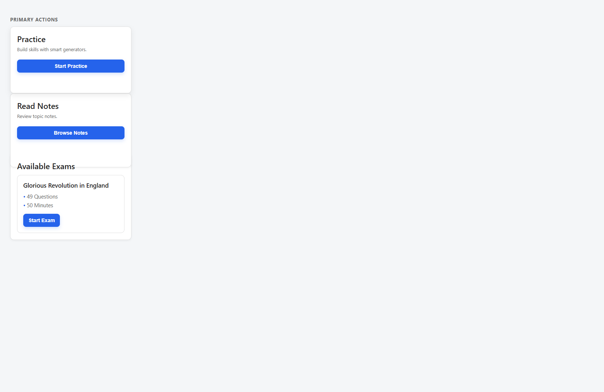
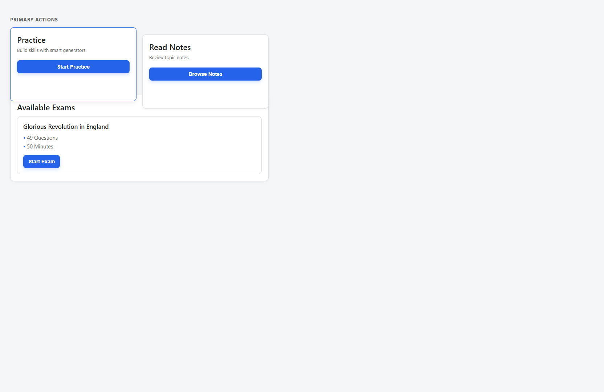
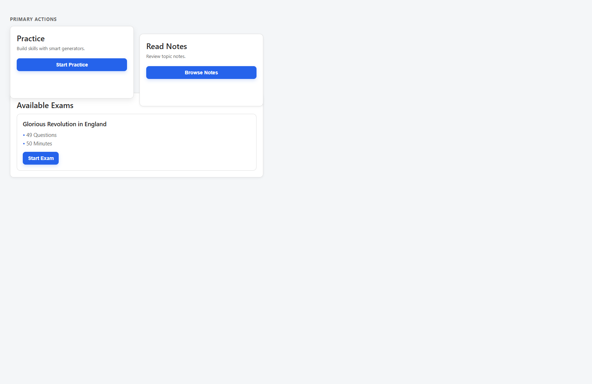

# Dashboard Touch Interaction Bug Fix

**Date:** 30 May 2026  
**Issue:** Practice and Read Notes cards overlap Available Exams after tap on mobile/tablet

---

## Root Cause

The overlap was caused by a **global `.card:hover` rule** in `css/style.css`:

```544:547:css/style.css
/* BEFORE (removed from global scope) */
.card:hover {
  transform: translateY(-2px);
  box-shadow: 0 6px 16px rgba(0, 0, 0, 0.08);
}
```

Supporting factors:

1. **`transition: all 0.2s ease`** on `.card` animated the transform, making the lift feel intentional but unstable on touch.
2. **Touch devices synthesize `:hover`** on tap; on many mobile browsers hover state **sticks** until another tap elsewhere.
3. Primary action cards use **`class="card student-action-card"`** (`student-dashboard.html`), so tapping Practice or Read Notes applied hover to the **entire card container**, shifting it up 2px with a larger shadow — visually overlapping the **Available Exams** block below.

No JavaScript handlers, z-index changes, or `position: relative` on dashboard cards were involved. Structure was correct; **CSS hover lift** caused the visual bug.

Exam cards (`.student-exam-card`) did not use `.card` and were not affected by this rule.

---

## Fix Applied

### Strategy

1. **Restrict hover lift to fine-pointer devices** using `@media (hover: hover) and (pointer: fine)` so phones/tablets never get `translateY`.
2. **Replace touch feedback** with non-moving `:active` styles (border + shadow only).
3. **Narrow card transitions** to border, shadow, and background — not `all` (prevents accidental transform animation).

### Files modified

| File | Change |
|------|--------|
| `css/style.css` | Scoped `.card:hover` transform to fine pointers; added `.card:active` and `.student-exam-card:active` touch feedback |

### CSS after fix

```css
.card {
  transition:
    border-color 0.2s ease,
    box-shadow 0.2s ease,
    background-color 0.2s ease;
}

@media (hover: hover) and (pointer: fine) {
  .card:hover {
    transform: translateY(-2px);
    box-shadow: 0 6px 16px rgba(0, 0, 0, 0.08);
  }
}

.card:active {
  border-color: var(--primary);
  box-shadow: var(--shadow-md);
}

.student-exam-card:active {
  border-color: var(--primary);
  box-shadow: var(--shadow-md);
}
```

### Expected behavior (verified by CSS logic)

| Action | Mobile / tablet | Desktop (mouse) |
|--------|-----------------|-----------------|
| Tap / click card | Border + shadow only; **no movement** | — |
| Hover card | No lift | Subtle lift + shadow (unchanged) |
| Tap button inside card | Button may scale (`button:active`); card does not lift | Same |

---

## Before / After

### Before (bug)

When `:hover` stuck after tapping a primary action card:

- Card elevated **2px** (`translateY(-2px)`)
- Stronger shadow read as floating above next section
- **Available Exams** appeared partially covered / misaligned

Conceptual reproduction: apply `transform: translateY(-2px)` + elevated shadow to the first `.card` in the dashboard stack.

### After (fix)

On touch devices `(hover: none)`:

- `:hover` lift rule **does not apply**
- `:active` gives border highlight only
- Card stays in document flow; **no overlap**

### Screenshots

Captured with production `style.css` + simulated sticky `:hover` (before) vs fix rules (after).

| Viewport | Before | After |
|----------|--------|-------|
| Mobile 390px |  |  |
| Tablet 768px |  |  |

**Manual check after deploy:**

1. Open `student-dashboard.html` on phone or DevTools device mode (390px and 768px).
2. Tap **Practice** card → card must not overlap **Available Exams**.
3. Tap **Read Notes** card → same.
4. Confirm subtle border/shadow feedback on press only.

---

## Related rules (unchanged)

These still use transform on interaction but are **not** dashboard layout cards:

- `button:active { transform: scale(0.97) }` — buttons only
- `.question-card:hover`, `.review-card:hover`, `.attempt-card:hover` — exam/teacher surfaces

Dashboard primary cards are fixed via the `.card` hover scope change above.

---

## Goal

Preserve professional touch feedback without movement, scale, z-index bumps, or layout shift on the student dashboard.
