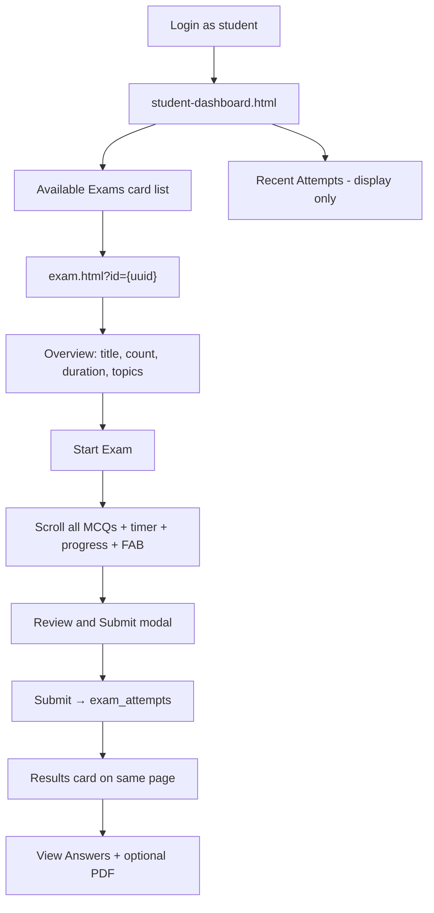

# Student Available Exams — Experience Audit

**Audit date:** 31 May 2026  
**Scope:** How a logged-in student discovers, starts, takes, and reflects on **teacher-assigned exams** (the “Available Exams” path)  
**Method:** Codebase review (`student-dashboard.html`, `js/student/*`, `js/exam.js`, Supabase RLS/migrations); incorporates Phase 1 student UI upgrades  
**Environment:** Local codebase (production deploy may lag local changes)

---

## Executive Summary

Assigned exams work end-to-end: the dashboard lists assignments, cards link to `exam.html?id=…`, and a logged-in assigned student gets a structured take flow (overview → timed attempt → submit modal → results → answer review → PDF). Phase 1 added meaningful polish (metadata on cards, overview screen, progress bar, review FAB, results card).

The experience is still **thin as a learning loop**: cards don’t show completion state, recent attempts are opaque UUIDs with no links, exam results don’t connect to notes/practice, and several edge cases (timer starting too early, retakes, error handling) can confuse or frustrate students.

---

## End-to-End Journey



### Route Map

| Step | Route / Surface | Source |
|------|-----------------|--------|
| Home | `student-dashboard.html` | `js/student-dashboard.js` |
| Available Exams list | `#availableExams` on dashboard | `js/student/student-dashboard-renderer.js` |
| Take exam | `exam.html?id={exam_session_uuid}` | `js/exam.js`, `exam.html` |
| Post-submit review | Same page (`#result`, review replaces `#quiz`) | `js/exam.js` (`submitExam`, `renderReview`) |

---

## 1. Discovery — “Available Exams” on the Dashboard

### What Works

| Aspect | Behavior |
|--------|----------|
| **Placement** | Below Primary Actions (Practice / Read Notes), above Topic Notes and intelligence sections — sensible priority. |
| **Data source** | `exam_assignments` joined to `exam_sessions` for the logged-in student. |
| **Card content** | Title, question count (from `schema_json`), duration, “Assigned by Teacher”, **Start Exam** button. |
| **Empty state** | Clear copy when nothing is assigned. |
| **Entry point** | Manual exam-ID entry was removed; assignments are the canonical path. |

**Assignment fetch** (`js/student/student-intelligence.js`):

```javascript
async function fetchStudentExamAssignments(sb, userId) {
  const { data, error } = await sb
    .from("exam_assignments")
    .select(`exam_sessions ( id, title, created_at, duration, schema_json )`)
    .eq("student_id", userId);
  // ...
}
```

**Card rendering** (`js/student/student-dashboard-renderer.js`):

- Title from `exam.title`
- Question count via `js/student/student-exam-meta.js` (`getExamQuestionCount`)
- Duration via `formatExamDuration(exam.duration)`
- Static line: “Assigned by Teacher”
- CTA: **Start Exam** → `exam.html?id={id}`

### Gaps

- **No attempt status** — Completed, in-progress, or “Retake” are not shown; every assignment always says **Start Exam**.
- **No exam title in Recent Attempts** — Only raw `Exam ID: {uuid}` and score (see Section 5).
- **No due date / urgency** — Assignments have no deadline field in the student UI.
- **Intelligence load failure** — If `loadStudentIntelligence()` throws, the dashboard shows error states for intelligence sections but **Available Exams never renders**; the list can stay stuck on “Loading exams…”.
- **Global nav** — Student nav preset (`NAV_PRESETS.studentHome`) only links to **Practice**; exams are reachable only from the dashboard scroll, not from top nav.

---

## 2. Launch — From Card to Exam Page

### What Works

- **Start Exam** navigates to `exam.html?id={examId}` via `resolveAppPath`.
- **RLS** — Authenticated students can read `exam_sessions` only if assigned (or admin/owner).
- **Home link** — Logged-in students see **← Dashboard** in the exam header (`setupExamHomeLink` in `js/exam.js`).

### Gaps

- **Public UUID bypass** — Anyone with the exam UUID can open the exam anonymously (`exam_sessions_select_public_take` for `anon` in `supabase/migrations/20260520130000_exam_sessions_public_take.sql`). Assignment is **not** required to *take* an exam—only to submit into canonical `exam_attempts`.
- **Unassigned logged-in student** — Can still load the exam via public RLS; submission falls through to `public_exam_attempts`, which **does not feed** dashboard intelligence or Recent Attempts.

---

## 3. Pre-Exam — Overview Screen

### What Works (Phase 1)

Before questions are active, students see an overview card (`#examOverviewSection`) with:

- Exam title
- Question count and duration (when present in DB)
- **Topics covered** (unique `topics[]` from questions — hidden if none)
- Name field **only for anonymous takers** (`setupOverviewNameField`)
- **Start Exam** button

Logged-in students get name auto-resolution from:

1. `learner_profiles.display_name` via `getLearnerProfile()` (`js/core/learner-profile.js`)
2. Auth user metadata / email local-part
3. `localStorage` fallback

### Gaps

- **Timer starts before “Start Exam”** — `startedAt` is written when the page loads, not when the student clicks Start. Time spent reading the overview **counts against** the exam clock once the timer runs.

  ```javascript
  // js/exam.js — set at loadExam(), before beginExamSession()
  if (!attemptState.startedAt) {
    attemptState.startedAt = Date.now();
    attemptState.duration = exam.duration || 1800;
  }
  ```

- **Misleading timer preview** — Header shows full duration on overview (`formatTimerPreview`), but elapsed time is already accumulating from page load.
- **No rules / instructions** — No explicit “one attempt”, navigation rules, or academic integrity copy.
- **Errors still use `alert()`** — Missing name, submit failure, time-up auto-submit.

---

## 4. In-Exam Experience

### What Works

| Feature | Status |
|---------|--------|
| **All MCQs on one scrollable page** | Active |
| **Autosave to localStorage** | Per-question radio changes persisted (`prepos-attempt-{examId}`) |
| **Progress bar** | `N / M Answered`, sticky during attempt (`#examProgressPanel`) |
| **Question indicator** | “Question X of Y” via scroll `IntersectionObserver` |
| **Countdown timer** | MM:SS remaining after Start (`TimerEngine` in `js/timer.js`) |
| **Review & Submit FAB** | Modal with answered/unanswered counts before submit |
| **Auto-submit on timeout** | Calls `submitExam()` when timer hits zero |

### Gaps

- **Still a long scroll** — Large exams (e.g. 49 questions) remain cognitively heavy; no paging, question palette, or flag-for-review.
- **Resume after submit is broken** — Local `attemptState.status === "submitted"` blocks re-submit, but **Start Exam still works**; student can answer again but submission silently no-ops.
- **Retake policy unclear** — No apparent DB uniqueness on `(student_id, exam_id)`; clearing localStorage allows multiple canonical submissions.
- **No connection to notes** — Wrong answers don’t link to topic notes or practice.

---

## 5. Post-Exam — Results and Return to Dashboard

### What Works

- **Results card:** score `X / Y`, accuracy %, questions attempted (`renderExamResults`).
- **View Answers:** full review with correct/wrong styling and expandable explanations (`renderReview`).
- **PDF export** after opening review (html2pdf + watermark).
- **Canonical storage** for assigned + logged-in students → `exam_attempts` with `student_id`, score, answers, `time_taken`.

**Canonical submission gate** (`js/exam.js`):

```javascript
async function canSubmitCanonicalAttempt(sb, examId, userId) {
  const { data } = await sb
    .from("exam_assignments")
    .select("id")
    .eq("exam_id", examId)
    .eq("student_id", userId)
    .maybeSingle();
  return !!data && !error;
}
```

### Gaps

- **No results hub** — Results live inline on `exam.html`; no persistent “view my result” URL from the dashboard.
- **Recent Attempts is dead-end UI** — Shows `Exam ID: {uuid}`, score, and timestamp only; no exam title, no link to review, no accuracy, no “Retake” vs “View results”.
- **Exam → learning loop disconnected** — Exam submissions can feed analytics (`PREPOS_ANALYTICS_ENABLED = true` in `js/analytics/analytics-config.js`), but the dashboard doesn’t surface topic breakdown from exams or route weak exam topics to practice/notes.
- **Learning intelligence copy** still emphasizes **verified practice**, not exams — students may not understand that exams contribute to their profile.

---

## 6. Access & Data Model (Student-Relevant)

| Path | Read exam | Submit to | Shows on dashboard |
|------|-----------|-----------|-------------------|
| Assigned + logged in | ✅ via assignment RLS | `exam_attempts` (canonical) | Recent Attempts + intelligence |
| Logged in, not assigned, has UUID | ✅ via public/anon RLS | `public_exam_attempts` | ❌ |
| Anonymous + UUID | ✅ | `public_exam_attempts` | ❌ |

**RLS highlights:**

- `exam_sessions_select_visible` — authenticated read if admin, creator, or assigned student.
- `exam_sessions_select_public_take` — anon read for shareable links (UUID as capability token).
- `exam_attempts_insert_assigned_student` — canonical insert only when `student_id = auth.uid()` and assignment exists.

**Implication:** “Available Exams” is the **intended** student path, but the product also allows parallel public take flows that don’t integrate with the student dashboard.

---

## 7. Strengths

1. **Clear assignment → take pipeline** without manual IDs.
2. **Rich pre-flight metadata** on dashboard cards and exam overview.
3. **In-exam orientation** improved materially (progress, position, submit confirmation).
4. **Post-submit review** is functional and pedagogically useful (explanations, PDF).
5. **Learner profile integration** for display names on authenticated takes.
6. **Autosave** reduces data loss on refresh/disconnect.

---

## 8. Priority Gaps (Ranked for Student Impact)

| Priority | Issue | Student impact |
|----------|-------|----------------|
| **P0** | Timer `startedAt` set at page load, not at Start | Unfair time loss on overview |
| **P0** | Post-submit revisit: can restart but can’t submit | Confusing dead end |
| **P1** | Available Exams cards ignore attempt history | No “Done” / “Continue” / “Retake” |
| **P1** | Recent Attempts shows UUID, no links | No way back to results |
| **P1** | Intelligence fetch failure blocks exam list | Dashboard appears broken |
| **P2** | Long single-page exams | Fatigue on large assessments |
| **P2** | No exam → notes/practice remediation | Weak feedback loop |
| **P2** | `alert()` for critical errors | Jarring, non-accessible UX |
| **P3** | No due dates / attempt limits | Teachers can’t signal urgency |
| **P3** | Public link vs assignment ambiguity | Split analytics identity |

---

## 9. Comparison to Prior Audit (May 2026)

Reference: `docs/PrepOS_Student_Experience_Audit_Report.md`, `docs/Phase1_Student_UI_Upgrade_Report.md`.

### Addressed by Phase 1

- Removed manual exam ID entry ✅
- Richer exam cards with question count + duration ✅
- Exam overview screen with metadata and topics ✅
- Progress bar, question indicator, Review & Submit FAB + modal ✅
- Upgraded results card (score, accuracy, attempted count) ✅
- Removed Eruda debug console from `exam.html` ✅
- Dashboard hierarchy: Primary Actions → Available Exams → Notes → Intelligence ✅

### Still Open

- Recent Attempts links ❌
- Paged exam UX ❌
- Inline errors instead of `alert()` ❌
- Exam results → remediation (notes/practice) ❌
- Timer start timing ❌ (regression / oversight in Phase 1)
- Assignment card completion state ❌

---

## 10. Recommended Next Fixes

Smallest high-impact set for the **available exams** experience without backend redesign:

1. **Start timer on “Start Exam”** — Move `startedAt` assignment into `beginExamSession()`.
2. **Decorate assignment cards** — Join latest `exam_attempts` per exam; show Completed / score / Retake.
3. **Fix Recent Attempts** — Resolve exam title from `exam_sessions`; link to `exam.html?id=…` (review or read-only results).
4. **Isolate exam list loading** — Fetch assignments in a separate try/catch so intelligence failures don’t block the exam list.
5. **Handle submitted local state** — On load, if `attemptState.status === "submitted"`, show results/review instead of Start Exam.

### Longer-Term (Product)

- Topic-aware post-exam breakdown with links to `note.html` and `practice.html?topic=…`
- Paged exam UI or question navigator for large assessments
- Due dates and attempt limits on assignments
- Student nav link to dashboard / exams section

---

## 11. Key Files Reference

| File | Role |
|------|------|
| `student-dashboard.html` | Available Exams section markup |
| `js/student-dashboard.js` | Orchestration, `startExamById()` |
| `js/student/student-intelligence.js` | Fetch assignments + attempts |
| `js/student/student-dashboard-renderer.js` | Render exam cards + recent attempts |
| `js/student/student-exam-meta.js` | Question count, duration, topics helpers |
| `exam.html` | Exam page shell (overview, quiz, results, modal) |
| `js/exam.js` | Load, take, submit, review, PDF |
| `js/timer.js` | Countdown engine |
| `js/core/learner-profile.js` | Display name for authenticated takers |
| `js/ui/app-nav.js` | Student nav preset (Practice only) |
| `supabase/migrations/20260517120000_enable_rls_backend_authority.sql` | Assignment + attempt RLS |
| `supabase/migrations/20260520130000_exam_sessions_public_take.sql` | Public exam link access |
| `supabase/migrations/20260522120000_create_public_exam_attempts.sql` | Guest/public submissions |

---

## 12. Bottom Line

The available-exams feature is **functionally complete** for assign → take → score → review, with solid Phase 1 UX during the attempt itself. What’s missing is **lifecycle awareness** (before/after the attempt on the dashboard) and a few **correctness bugs** (timer, retake/submit state) that undermine trust in timed assessments.

---

*Generated from codebase audit on 31 May 2026.*
