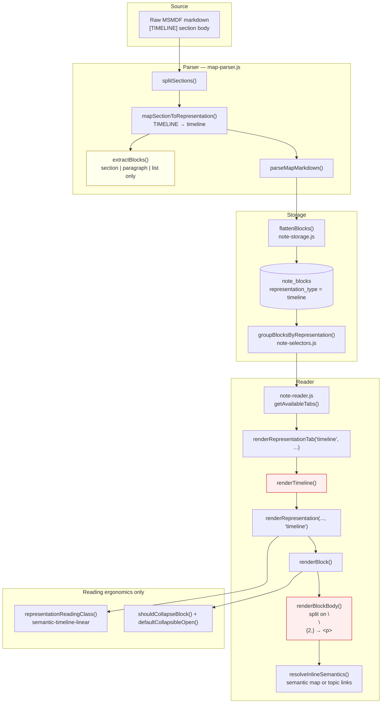

# Timeline Representation — Semantic Rendering Architecture Audit

**Scope:** Diagnostic only (no renderer fixes, CSS patches, MSMDF rewrites, or parser redesign).  
**Date:** 2026-05-27  
**Stress test:** Timeline is the first major case for evolving PrepOS from generic markdown rendering toward representation-aware semantic cognition rendering.

---

## Executive summary

Timeline content **is correctly routed** through the MSMDF boundary `[TIMELINE]` → `representations.timeline` → `renderTimeline()` → `renderRepresentationTab()`. However, **`renderTimeline` is not a chronology renderer** — it is a thin alias that reuses the same `renderBlock` / `renderBlockBody` path as Narrative and Revision.

Chronology grammar in source markdown (separators, year/event lines, annotations) **survives as plain text** in `paragraph` and `section` blocks but is **never classified or rendered** as temporal structure. The dominant cognition failure is **representation-generic rendering**; the parser **contributes** by using prose-oriented block extraction and flat sibling blocks (no parent/child clustering under layer headings).

---

## A. Full Timeline rendering pipeline



### Step-by-step authority chain

| Step | Module | What happens for Timeline |
|------|--------|---------------------------|
| 1 | `splitSections` | `[TIMELINE]` detected as MSMDF v1.2 boundary; body isolated |
| 2 | `extractBlocks('timeline', body)` | Generic block types: `section` (ATX `#`), `paragraph`, `list` |
| 3 | `parseMapMarkdown` | Blocks pushed to `parsed.representations.timeline`; `metadata_json.msmdf_boundary: "TIMELINE"` |
| 4 | `flattenBlocks` | Pass-through rows; no timeline-specific transform |
| 5 | DB `note_blocks` | Stored with `representation_type: 'timeline'` |
| 6 | `groupBlocksByRepresentation` | Rebuilds `bundle.representations.timeline[]` |
| 7 | `getAvailableTabs` | Timeline tab if `timeline.length > 0` |
| 8 | `renderTimeline` | Calls `renderRepresentation` with class `representation-timeline` |
| 9 | `renderBlock` | Same as revision/narrative except `representationKey === 'timeline'` |
| 10 | `renderBlockBody` | **Narrative paragraph HTML** (`<p class="semantic-paragraph">`) |
| 11 | CSS | Only `.semantic-timeline-linear` adjusts collapsible spacing — **no chronology nodes** |

**Answer to audit question A:** Timeline uses **generic narrative paragraph rendering** inside a representation-scoped wrapper (`semantic-timeline-linear`). There is **no** `renderChronologyNode`, no timeline tree, and no structural-style hierarchy builder for timeline blocks.

---

## B. Chronology grammar pattern inventory

Patterns observed in production-style Timeline markdown (user-reported canonical shape) and verified against `extractBlocks` / `renderBlockBody` behavior.

| Pattern | Example | Parser treatment | Rendered as |
|---------|---------|------------------|-------------|
| **Layer heading** | `# ENGLISH REVOLUTION — CHRONOLOGY LAYER` | `block_type: section`, `hierarchy_level: 1`, `content: null` | Collapsible `<details>` with **empty** body; chronology siblings are **not nested** under it |
| **Chronology separator** | `────────` (U+2500) | `paragraph` content (literal string), often its own block if blank lines separate lines | `<p>────────</p>` — visible separator artifact |
| **Year / range event marker** | `1215 — [[Magna Carta]]`, `1629–1640 — [[Eleven Years' Tyranny]]` | `paragraph` (single line) | `<p>` with inline topic/semantic links; no date column, no milestone role |
| **Annotation / gloss** | `Early constitutional limitation on monarchy` | `paragraph` | Generic `<p>`; indistinguishable from narrative prose |
| **Entity-only line** | `[[Charles I]] rules without Parliament` | `paragraph` | Generic `<p>` with resolved `[[...]]` |
| **Wiki-link emphasis** | `[[Topic]]` | `extractTopicLinks` at parse time; `resolveInlineSemantics` at render | Works for **anchors**, not for **chronology layout** |
| **Tight stacking** (single `\n` between lines) | User sample without blank lines | **One** `paragraph` block containing all lines joined by `\n` | **One** `<p>`; HTML collapses internal newlines to spaces → **chronology visually merges** |
| **Loose stacking** (blank line between lines) | Alternate authoring style | Separate `paragraph` blocks per line/separator | Separate `<article>` per line — still prose blocks, not chronology nodes |
| **List syntax** | `- item` / `1.` | `list` if line matches `isListLine` | `<ul>` — rare in timeline grammar; same as other representations |
| **Transition markers** | (authoring convention, not codified) | Treated as plain `paragraph` unless matched as heading/list | No transition role |

### Recurring grammar (informal MSMDF Timeline dialect)

```
[LAYER HEADING]     →  # Title — CHRONOLOGY LAYER
[SEPARATOR]         →  ────────
[EVENT]             →  {year|range} — [[Entity/Event]]
[SEPARATOR]
[ANNOTATION]        →  free text gloss
[SEPARATOR]
...
```

This dialect is **authoring-stable** but **not represented** in `block_type` or renderer roles.

---

## C. Representation rendering authority audit

| Layer | Timeline-specific? | Authority |
|-------|-------------------|-----------|
| MSMDF boundary `[TIMELINE]` | Yes | Routes body to `representations.timeline` |
| `extractBlocks` | **No** | Same algorithm for all representation keys |
| Recall special-case | Partial precedent | `[RECALL]` remaps `block_type` to `recall` / `recall_section` — **Timeline has no equivalent** |
| `flattenBlocks` / DB | **No** | Opaque storage of generic blocks |
| `renderTimeline` | **Nominal only** | Delegates to `renderRepresentation` |
| `renderStructural` | N/A | **Contrast:** `buildStructuralTree()` + dedicated HTML — Timeline has **no** analogue |
| `semantic-hierarchy.js` | Partial | `shouldCollapseBlock`: timeline sections → collapsible; narrative/structural exempt |
| `reading-ergonomics.js` | Partial | `semantic-timeline-linear`, timeline collapsibles default `open` |
| `css/style.css` | Minimal | Collapsible border tweaks under `.semantic-timeline-linear` — **no chronology layout** |
| Inline semantics | Shared | Semantic map / topic links work; **orthogonal** to chronology layout |

**Answer E:** Timeline has **representation-specific routing and CSS class naming only**, not representation-specific **semantic rendering**. It is still routed through **generic prose rendering infrastructure**.

---

## D. Exact location where chronology semantics collapse

Semantics are lost in **two cooperating stages** (not MSMDF syntax detection):

### 1. Parser — structural typing & clustering (secondary but real)

**File:** `js/notes/map-parser.js` — `extractBlocks()`

- No `chronology_separator`, `chronology_event`, `chronology_annotation`, or `chronology_cluster` types.
- Section headings do **not** own following lines (flat block list; unlike `buildStructuralTree` consumption in structural rendering).
- Single-newline-authored timelines collapse into **one paragraph block** (verified).

### 2. Renderer — cognition model (primary)

**File:** `js/notes/note-renderer.js` — `renderRepresentation` → `renderBlock` → `renderBlockBody`

- All non-list timeline body → `canonical-paragraph` / `semantic-paragraph`.
- Paragraph splitting uses `\n{2,}` only — single newlines inside a block do not create separate DOM nodes.
- Section blocks with `content: null` render as **empty collapsibles** while chronology content appears as **sibling** `<article>` elements — breaks layer → events grouping.
- Separator characters render as **readable text** in paragraphs.

### 3. Not failure points

| Location | Verdict |
|----------|---------|
| MSMDF section detection | Working |
| `flattenBlocks` | Pass-through; does not strip semantics |
| `resolveInlineSemantics` | Preserves links; does not flatten chronology |
| `groupBlocksByRepresentation` | Faithful restore |

### Reconciling “not a parser problem”

The **Timeline dialect and chronology intent are present in source markdown** — MSMDF boundary and prose are preserved. The issue is **not** “Timeline failed to parse as a section.” It **is** representation-specific semantic rendering failure: the system never assigns or renders **chronology roles**. The parser nonetheless **does** flatten chronology into prose block types, which amplifies renderer collapse — especially for tightly stacked sources.

**Primary authority failure:** `renderTimeline` → shared `renderBlockBody` prose path.  
**Amplifying failure:** `extractBlocks` prose block model + flat section/event siblings.

---

## E. Minimal architecture evolution proposal

Goal: chronology cognition with **small, stable** surface area — mirror the **Recall** precedent (parser labels + renderer respects types), not a second Structural tree engine.

### Phase 1 — Renderer (minimal UX win, can follow parser)

Add `renderTimelineBlock(block)` branch in `renderBlock` / body helper:

| `block_type` (new) | HTML role (sketch) |
|--------------------|-------------------|
| `chronology_layer` | `<header class="chronology-layer">` (non-collapsible or optional fold) |
| `chronology_separator` | `<hr class="chronology-separator" aria-hidden="true">` |
| `chronology_event` | `<div class="chronology-event"><time>…</time><div class="chronology-event-title">…</div></div>` |
| `chronology_annotation` | `<p class="chronology-annotation">` |

Keep inline semantics path unchanged inside text fields.

### Phase 2 — Parser (timeline-scoped `extractBlocks` or post-pass)

In `parseMapMarkdown`, when `representationKey === 'timeline'`, run **`extractTimelineBlocks(body)`** (or post-process paragraph blocks):

1. `# …` → `chronology_layer` (retain heading text, optional `hierarchy_level`).
2. Line matching `^─{4,}$` → `chronology_separator`.
3. Line matching `^(\d{3,4}(?:\s*[–-]\s*\d{3,4})?)\s*[—–-]\s*(.+)$` → `chronology_event` with `metadata_json.year` / `label`.
4. Other non-empty lines between separators → `chronology_annotation`.
5. Optionally group into `chronology_cluster` metadata (layer + ordered children) **without** full tree UI.

**Avoid:** regex-heavy renderer guessing on every `<p>`; massive `renderBlock` rewrite; changing MSMDF boundary syntax.

### Phase 3 — CSS (after semantics exist)

Targeted rules under `.semantic-timeline-linear` for event columns, separator suppression, annotation indentation — **only after** semantic HTML exists.

---

## F. Parser-level vs renderer-level chronology semantics

| Approach | Pros | Cons |
|----------|------|------|
| **Parser-level structures** (recommended) | Stable block model in DB; consistent preview + published reader; testable; matches Recall precedent; renderer stays dumb HTML mapping | Requires timeline-specific extract pass; migration for existing notes on re-save |
| **Renderer-level pattern detection** | No parser change; faster experiment | Fragile regex on merged paragraphs; duplicated logic in preview vs reader; hard to persist clustering; fights `renderBlockBody` paragraph model |

**Recommendation:** **Parser-level chronology block types** for `[TIMELINE]` bodies only, plus a **thin timeline branch** in `note-renderer.js`. Renderer detects types; it does not infer grammar from raw prose.

**Tradeoff:** Slight protocol–parser alignment (Timeline dialect formalized inside parser, not new MSMDF boundary tags). MSMDF boundary stays `[TIMELINE]`; chronology micro-grammar is a **representation profile** of `extractBlocks`.

---

## G. Future representation-aware rendering architecture notes

PrepOS is **approaching** representation-intelligent rendering, but Timeline exposes the gap:

| Representation | Current cognition model |
|----------------|----------------------|
| Narrative | Reading flow — open paragraphs |
| Structural | **Dedicated** tree renderer (`buildStructuralTree`) |
| Revision / Interpretations | Compact collapsible prose |
| **Timeline** | **Mislabeled** — prose + `semantic-timeline-linear` chrome |
| Interpretations | Same as revision (compact prose) |

### Target direction (conceptual)

```
representation_key → cognition_profile → { block_types, render_fn, reading_css }
```

- **Narrative** → semantic reading flow  
- **Structural** → hierarchy cognition (existing)  
- **Timeline** → chronology cognition (**missing**)  
- **Revision** → retrieval compression  
- **Interpretations** → perspective comparison  

### First-class chronology concepts (for Timeline profile)

| Concept | Purpose |
|---------|---------|
| `chronology_layer` | Thematic / unit phase (e.g. “English Revolution — Chronology Layer”) |
| `chronology_cluster` | Optional grouped events under one layer |
| `chronology_separator` | Visual/semantic beat between entries |
| `chronology_event` | Dated or ranged milestone with title/links |
| `chronology_annotation` | Causal/context gloss |
| `chronology_transition` | Optional phase shift (if authors adopt markers) |

Shared infrastructure (`resolveInlineSemantics`, reading ergonomics, semantic map) should remain **cross-representation**; only **layout and block typing** vary.

---

## H. Verification artifacts (audit session)

Sample markdown (tight stacking, no blank lines) produced:

- **2 blocks:** one `section`, one `paragraph` containing the entire chronology body as a single string.
- **Rendered HTML:** empty collapsible layer heading + one dense `<p>` with literal `────────` and embedded newlines.

Sample with blank lines between entries produced **separate paragraph blocks** per separator/event/annotation — still generic `<article><p>` structure.

Scripts used: `tmp-timeline-parse.mjs`, `tmp-timeline-render.mjs` (local, not committed).

---

## Audit checklist (deliverables)

| ID | Deliverable | Status |
|----|-------------|--------|
| A | Full Timeline rendering pipeline diagram | Above (mermaid) |
| B | Chronology grammar pattern inventory | Section B |
| C | Representation rendering authority audit | Section C |
| D | Exact collapse location | Section D |
| E | Minimal architecture evolution proposal | Section E |
| F | Parser vs renderer recommendation | Section F |
| G | Future representation-aware rendering notes | Section G |
| H | This document | `docs/Timeline_Representation_Semantic_Rendering_Audit.md` |

---

## Key code references

`renderTimeline` — alias only:

```422:429:js/notes/note-renderer.js
export function renderTimeline(blocks, topicMap, renderOptions) {
  return renderRepresentation(
    blocks,
    topicMap,
    "representation-timeline",
    renderOptions,
    "timeline"
  );
}
```

Shared prose body rendering:

```89:117:js/notes/note-renderer.js
function renderBlockBody(block, topicMap, renderOptions) {
  if (block.block_type === "list") {
    return renderListContent(block.content, topicMap, renderOptions);
  }
  // ...
  const paragraphs = String(block.content)
    .split(/\n{2,}/)
    // ...
      return `<p class="canonical-paragraph semantic-paragraph${denseClass}">${resolveInlineSemantics(
```

Generic block extraction (all representations):

```122:206:js/notes/map-parser.js
function extractBlocks(sectionKey, body, extraMetadata = {}) {
  // section | list | paragraph only
}
```

Timeline collapsible policy:

```91:100:js/notes/semantic-hierarchy.js
export function shouldCollapseBlock(block, representationKey) {
  if (representationKey === "narrative" || representationKey === "structural") {
    return false;
  }
  return (
    block.block_type === "section" ||
    // ...
  );
}
```

---

## Recommended next step (implementation — out of scope for this audit)

1. Add timeline-scoped block extraction (Recall-style).  
2. Add `renderTimelineBlock` branches + minimal CSS under `.semantic-timeline-linear`.  
3. Add `map-parser.test.js` fixtures for tight vs loose Timeline stacking.  
4. Re-save or migrate existing canonical notes to regenerate `note_blocks` with new types.

**Do not** implement in this audit pass.
