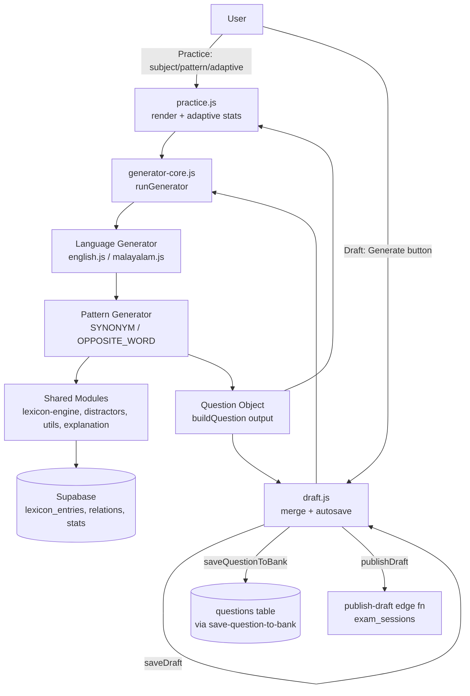
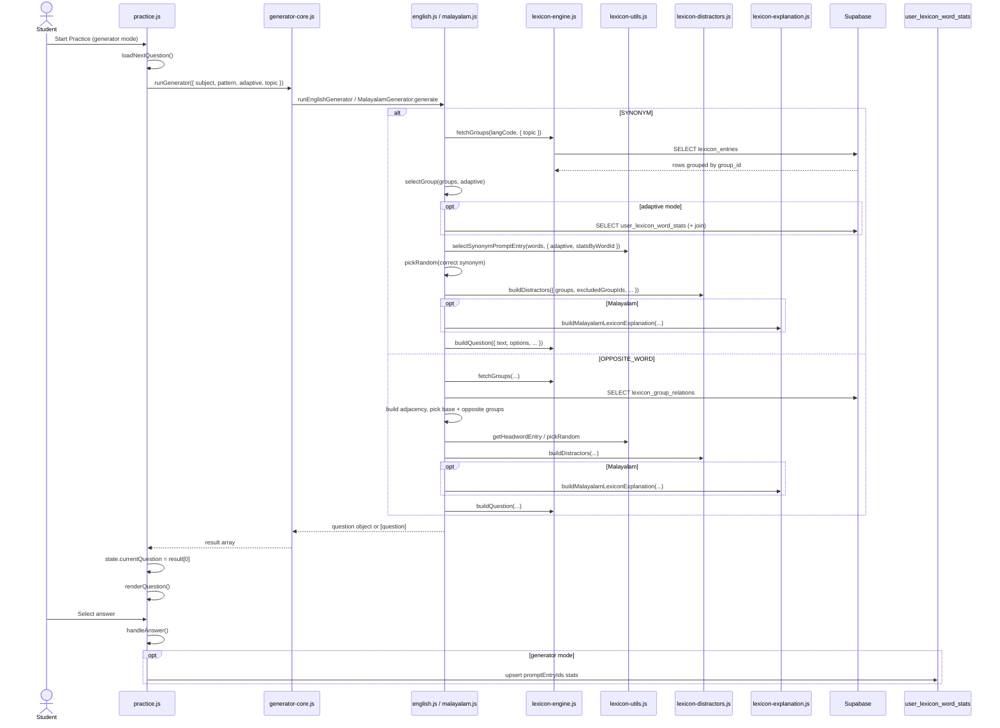
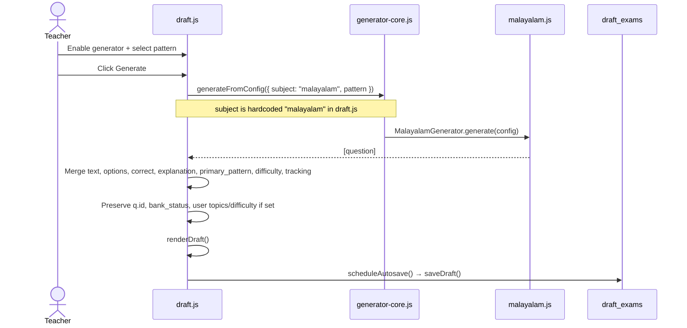
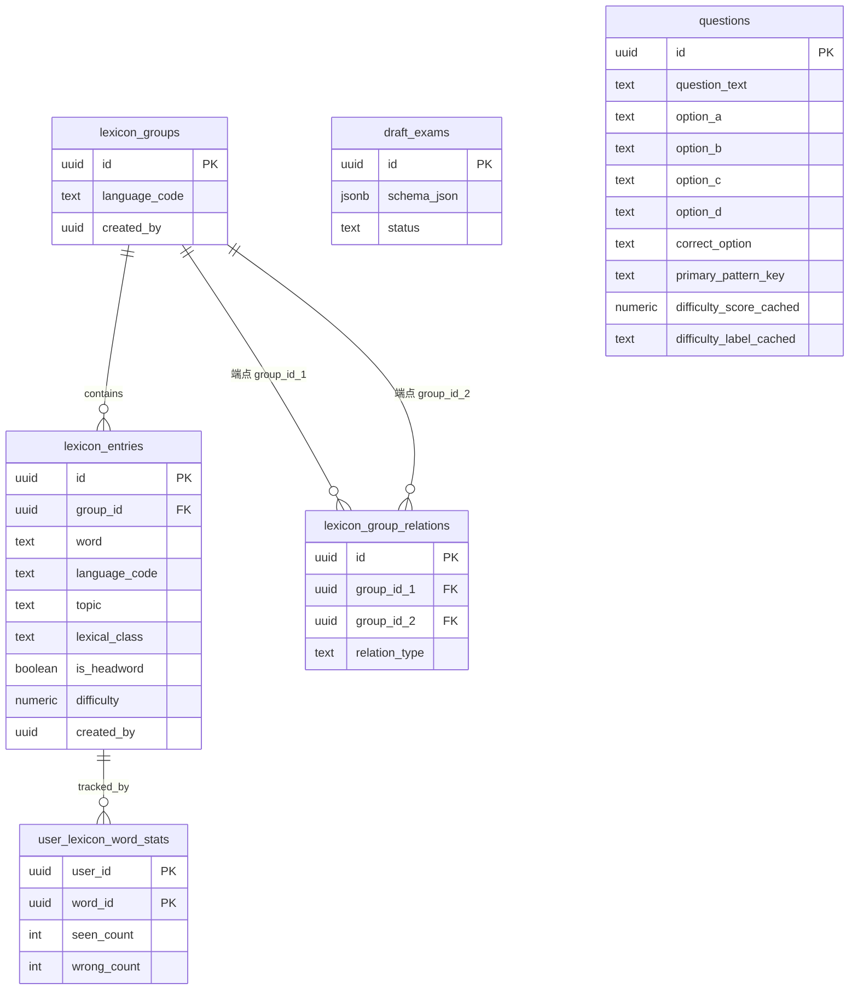
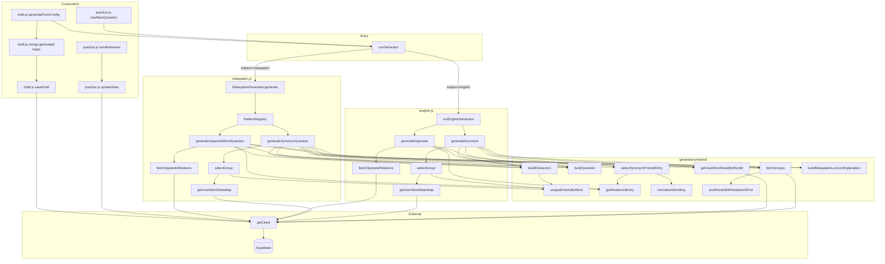

# PrepOS English & Malayalam Question Generator — Architecture Audit

> **Scope:** Reverse-engineered documentation of the generator system as it exists in the codebase today.  
> **Date:** 2026-07-10  
> **Rule:** Descriptive only. No recommendations, redesigns, or proposed features.

---

## SECTION 1 — HIGH LEVEL ARCHITECTURE

PrepOS question generation is a **client-side, lexicon-driven, rule-based MCQ generator**. It reads vocabulary data from Supabase, assembles 4-option single-answer questions in memory, and returns JavaScript objects consumed by **Practice** (student) and **Draft** (teacher) UIs. There is no server-side generator runtime; database writes happen only through separate flows (draft autosave, question bank save, adaptive stats).

### Architectural layers

| Layer | Role |
|-------|------|
| **Entry** | `js/generator-core.js` — `runGenerator(config)` dispatches by `subject` |
| **Language generators** | `js/generators/english.js`, `js/generators/malayalam.js` |
| **Pattern handlers** | Per-pattern functions inside each language file (`SYNONYM`, `OPPOSITE_WORD`) |
| **Shared lexicon utilities** | `js/generators/shared/*` — fetch, build, distractors, explanations, utils |
| **Consumers** | `js/practice.js` (live practice), `js/draft.js` (teacher draft authoring) |
| **Lexicon authoring** | `js/lexicon-manager.js` — populates DB tables used by generators |
| **Parser (parallel path)** | `js/core/question-parser.js` — QCP paste/import; **not** invoked by generators |
| **Persistence** | `draft_exams` (draft JSON), `questions` + metadata (bank), `user_lexicon_word_stats` (adaptive) |

### English vs Malayalam dispatch asymmetry

- **English:** `runGenerator` calls `runEnglishGenerator(config)` directly (not in the `Generators` registry).
- **Malayalam:** `runGenerator` looks up `Generators.malayalam` → `MalayalamGenerator.generate(config)`.
- **Maths:** Comment placeholder in registry — not implemented.

### End-to-end flow (conceptual)



### Parser interaction

Generators **do not** call `question-parser.js`. Parsed questions (QCP paste) and generated questions converge on the **same in-memory question object shape** used by `draft.js`. The parser sets `generator.source: "parser"`; generators set `bank_status: "draft"` via `buildQuestion`.

### Exam generation workflow

1. Teacher creates/edits questions in `draft.html` (`js/draft.js`), optionally using the per-question generator panel (Malayalam only, hardcoded).
2. Draft autosaves to `draft_exams.schema_json`.
3. Teacher may save individual questions to the bank via `save-question-to-bank` edge function.
4. Publishing calls `publish-draft` edge function with `draftId`, creating an `exam_sessions` record.
5. **Exam taking does not invoke generators** — it uses published question content from the draft/exam schema.

---

## SECTION 2 — FILE INVENTORY

### Core entry

| Path | Purpose | Responsibilities | Exports | Imports | Dependencies |
|------|---------|------------------|---------|---------|--------------|
| `js/generator-core.js` | Single entry point for all generators | Dispatch by `config.subject` | `runGenerator` | `MalayalamGenerator`, `runEnglishGenerator` | Browser `window` (indirect via consumers) |

### Language generators

| Path | Purpose | Responsibilities | Exports | Imports | Dependencies |
|------|---------|------------------|---------|---------|--------------|
| `js/generators/english.js` | English vocabulary MCQs | `SYNONYM`, `OPPOSITE_WORD` patterns; group selection; adaptive group scoring | `runEnglishGenerator` | `lexicon-engine`, `lexicon-utils`, `lexicon-distractors`, `get-client` | Supabase tables: `lexicon_entries`, `lexicon_group_relations`, `user_lexicon_word_stats` |
| `js/generators/malayalam.js` | Malayalam vocabulary MCQs | Pattern registry; Malayalam templates; lexical-class distractors; explanations | `MalayalamGenerator` | Same shared modules + `lexicon-explanation`, `get-client` | Same Supabase tables |

### Shared generator modules

| Path | Purpose | Responsibilities | Exports | Imports | Dependencies |
|------|---------|------------------|---------|---------|--------------|
| `js/generators/shared/lexicon-engine.js` | Data fetch + question builder | `fetchGroups`, `getUserWordStatsByWordId`, `buildQuestion` | `fetchGroups`, `getUserWordStatsByWordId`, `buildQuestion`, `DEFAULT_LEXICON_TOPIC` | `get-client`, `lexicon-utils` | `lexicon_entries`, `user_lexicon_word_stats` |
| `js/generators/shared/lexicon-utils.js` | Lexicon helpers | Headword logic, prompt selection, validation, lexical class inference | `normalizeWordKey`, `getHeadwordEntry`, `selectSynonymPromptEntry`, `LEXICAL_CLASS_OPTIONS`, `validateGeneratorReadiness`, etc. | — | Used by generators + `lexicon-manager.js` |
| `js/generators/shared/lexicon-distractors.js` | Distractor pool builder | Exclude groups/words; optional lexical-class filter; dedupe by word | `buildDistractors`, `uniqueEntriesByWord` | — | — |
| `js/generators/shared/lexicon-explanation.js` | Malayalam practice explanations | Computed `explanation` + `explanationMeta` | `buildMalayalamLexiconExplanation` | — | Malayalam generator + `practice.js` UI |

### Consumer modules

| Path | Purpose | Generator-related responsibilities | Key imports |
|------|---------|-----------------------------------|-------------|
| `js/practice.js` | Student practice UI | Calls `runGenerator`; renders questions; updates `user_lexicon_word_stats` in generator mode | `runGenerator`, `DEFAULT_LEXICON_TOPIC` |
| `js/draft.js` | Teacher draft editor | Per-question Generate/Regenerate (Malayalam hardcoded); merges generated fields; autosave draft | `runGenerator` |

### Lexicon data authoring

| Path | Purpose | Generator-related responsibilities |
|------|---------|-----------------------------------|
| `js/lexicon-manager.js` | Staff UI for word groups | CRUD on `lexicon_entries`, `lexicon_groups`, `lexicon_group_relations`; validates generator readiness |
| `js/lexicon/lexicon-group-search.js` | Group search helpers | Lexical class resolution for manager UI |

### Infrastructure

| Path | Purpose |
|------|---------|
| `js/core/get-client.js` | Async Supabase client loader (`window.supabaseClient` / `prepOSClientReady`) |
| `js/core/question-parser.js` | QCP parser — parallel question ingestion path (not generator) |
| `supabase/functions/save-question-to-bank/index.ts` | Edge wrapper for `save_question_to_bank` RPC |
| `supabase/migrations/20260621000000_question_assistance_malayalam.sql` | Latest `save_question_to_bank` function definition |

### Test files

| Path | Purpose |
|------|---------|
| `js/generators/shared/lexicon-distractors.test.js` | Unit tests for distractor logic |
| `js/generators/shared/lexicon-utils.test.js` | Unit tests for headword/prompt/validation utilities |

### HTML shells

| Path | Generator UI |
|------|--------------|
| `practice.html` | Subject (`malayalam`/`english`), pattern (`SYNONYM`/`OPPOSITE_WORD`), adaptive toggle |
| `draft.html` | Per-question generator panel (Malayalam patterns only in UI) |
| `lexicon-manager.html` | Lexicon data management |

---

## SECTION 3 — GENERATOR FLOW

### 3A — Practice mode (student)



### 3B — Draft mode (teacher generate button)



### Function call order (SYNONYM — canonical)

1. `runGenerator(config)` — `js/generator-core.js`
2. `runEnglishGenerator(config)` **or** `MalayalamGenerator.generate(config)`
3. `fetchGroups(languageCode, { topic })` — `lexicon-engine.js`
4. `selectGroup(groups, getAdaptiveMode(config))` — language file
   - `getUserWordStatsMap()` (if adaptive) — language file
   - `uniqueEntriesByWord`, `pickRandom`, `getGroupWords` — language file
5. `getUserWordStatsByWordId()` (if adaptive, for prompt selection) — `lexicon-engine.js`
6. `selectSynonymPromptEntry(words, { adaptive, statsByWordId })` — `lexicon-utils.js`
7. `pickRandom` correct synonym from same group — language file
8. `buildDistractors({ groups, excludedGroupIds, excludedWords, preferredLexicalClass?, count: 3 })` — `lexicon-distractors.js`
9. *(Malayalam only)* `buildMalayalamLexiconExplanation(...)` — `lexicon-explanation.js`
10. `shuffle` options — language file
11. `buildQuestion({ text, options, correctIndex, pattern, difficulty, topics, explanation, explanationMeta, tracking })` — `lexicon-engine.js`
12. Return single question (English) or `[question]` (Malayalam)

### Function call order (OPPOSITE_WORD)

1–3. Same entry and `fetchGroups`
4. `fetchOppositeRelations()` — language file → `lexicon_group_relations`
5. Build adjacency map; filter `linkedGroupIds`
6. `pickRandom(linkedGroupIds)` → base group
7. `pickRandom(oppositeCandidates)` → opposite group
8. `getHeadwordEntry` / `pickRandom` for stem and correct answer
9. `buildDistractors` (excludes both groups)
10. *(Malayalam only)* `buildMalayalamLexiconExplanation`
11. `buildQuestion` → return

### Save to draft (not automatic on practice)

Practice **does not** save generated questions to draft. Draft save occurs via `saveDraft()` writing `schema_json` to `draft_exams`.

---

## SECTION 4 — ENGLISH GENERATOR

**File:** `js/generators/english.js`  
**Entry:** `runEnglishGenerator(config)`

### Supported patterns

| Pattern key | Handler | Return shape |
|-------------|---------|--------------|
| `SYNONYM` | `generateSynonym(groups, config)` | Single question object |
| `OPPOSITE_WORD` | `generateOpposite(groups, config)` | Single question object |
| *(any other)* | `default` switch branch | Empty array `[]` (no error) |

### Pattern selection

- Caller passes `config.pattern` (from `practice.html` `#patternSelect`).
- No internal pattern randomization.

### Question templates

| Pattern | Template |
|---------|----------|
| SYNONYM | `Which word is closest in meaning to "{word}"?` |
| OPPOSITE_WORD | `Which word is opposite in meaning to "{word}"?` |

Stem word selection:
- **SYNONYM:** `selectSynonymPromptEntry` (adaptive headword scaffolding)
- **OPPOSITE_WORD:** headword of base group, else random entry

### Distractor generation

- Uses `buildDistractors` **without** `preferredLexicalClass`.
- SYNONYM: excludes prompt's synonym group; blocks prompt + correct words.
- OPPOSITE: excludes base + opposite groups; blocks stem + correct words.
- Always requests `count: 3` distractors → 4 total options.

### Answer generation

- **SYNONYM:** Random other word from same `group_id` (excluding normalized prompt word).
- **OPPOSITE_WORD:** Headword of opposite linked group (or random from that group).

### Difficulty handling

- Hardcoded on every generated question: `{ score: 2, label: "easy" }`.
- `lexicon_entries.difficulty` column is fetched but **not used** by the generator.

### Metadata

| Field | Value |
|-------|-------|
| `primary_pattern` | `SYNONYM` or `OPPOSITE_WORD` |
| `topics` | `["ENGLISH", "VOCABULARY", "SYNONYM"]` or `["ENGLISH", "VOCABULARY", "ANTONYM"]` |
| `bank_status` | `"draft"` (via `buildQuestion`) |
| `tracking.promptEntryIds` | `[questionEntry.id]` or `[stemEntry.id]` |
| `tracking.correctEntryIds` | `[correctEntry.id]` |
| `explanation` | Empty string |
| `explanationMeta` | Not set |

### Randomization

- `shuffle` / `pickRandom` using `Math.random()` (in-place `sort(() => Math.random() - 0.5)`).
- No seed handling.

### Topic usage

- `config.topic || DEFAULT_LEXICON_TOPIC` (`"vocabulary"`).
- Passed to `fetchGroups("en", { topic })` → filters `lexicon_entries.topic`.

### Adaptive mode

- `DEFAULT_ADAPTIVE_MODE = true`.
- Overridable via `config.adaptive`.
- **Group selection:** scores groups by average word weakness (`wrong_count/seen_count`, default 1 if unseen); picks randomly from top 5.
- **Prompt selection:** headword until familiar (`seen_count >= 3` and error rate `<= 0.34`), then random.

### Limitations (factual)

- Only two patterns; unknown patterns return `[]`.
- No Malayalam-style computed explanations.
- No `preferredLexicalClass` distractor filtering.
- Opposite pattern ignores `config` adaptive flag (`_config` unused).
- Duplicate `shuffle`/`uniqueEntriesByWord` implementations exist in language file (not shared with `lexicon-distractors.js` shuffle).
- Draft UI does not expose English generator (practice only).

---

## SECTION 5 — MALAYALAM GENERATOR

**File:** `js/generators/malayalam.js`  
**Entry:** `MalayalamGenerator.generate(config)` via pattern registry

### Pattern registry

```javascript
const PatternRegistry = {
  SYNONYM: generateSynonymQuestion,
  OPPOSITE_WORD: generateOppositeWordQuestion
};
```

Unknown pattern → `throw new Error("Unknown Malayalam pattern: " + pattern)`.

### Relationship types

| Source | Types used |
|--------|------------|
| `lexicon_group_relations.relation_type` | Generator accepts rows where `relation_type` is **null/empty** or **`ANTONYM`** |
| `lexicon-manager.js` UI | Creates relations with `relation_type: "ANTONYM"` only |

**Not found in current implementation:** SYNONYM, HYPONYM, or other relation types in generator logic.

### Lexicon usage

- `fetchGroups("ml", { topic })` — Malayalam entries only (`language_code = "ml"`).
- Synonym groups = shared `group_id`.
- Opposite pairs = `lexicon_group_relations` edges between groups.

### Pattern logic

Same structural logic as English with these additions:

1. **Malayalam question stems:**
   - SYNONYM: `{word} എന്ന വാക്കിന്റെ പര്യായം ഏത്?`
   - OPPOSITE: `{word} എന്ന വാക്കിന്റെ വിരുദ്ധം ഏത്?`
2. **`preferredLexicalClass`** passed to `buildDistractors` from prompt/stem entry's `lexical_class`.
3. **`buildMalayalamLexiconExplanation`** populates `explanation` and `explanationMeta`.
4. Returns **array** `[question]` (consumer takes `result[0]`).

### Randomization

Same as English (`shuffle`, `pickRandom`, `Math.random`). Adaptive group/prompt logic identical.

### Question assembly

`buildQuestion` + Malayalam topics: `["MALAYALAM", "VOCABULARY", "SYNONYM"]` or `ANTONYM` variant.

### Parser compatibility

- Generated questions use standard 4-option `{ id: "A"\|"B"\|"C"\|"D", text }` shape compatible with draft and parser output.
- Malayalam QCP labels (`ഉത്തരം`, `വിശദീകരണം`) are **parser** features; generator does not emit QCP text.
- `explanationMeta` is used by `practice.js` for rich feedback; **draft merge does not copy `explanationMeta`** (not found in `draft.js` generator merge).

### Current limitations (factual)

- Draft generator UI hardcodes `subject: "malayalam"` — no English from draft panel.
- Unknown patterns throw (vs English empty array).
- Opposite pattern ignores adaptive config.
- `explanationMeta` lost when teacher generates into draft.
- Lexical class on entries depends on lexicon-manager authoring (`default_lexical_class` applied on save).

---

## SECTION 6 — SHARED GENERATOR API

### `runGenerator(config)`

**Input:**

```typescript
{
  subject: "english" | "malayalam" | string,
  pattern: "SYNONYM" | "OPPOSITE_WORD",
  adaptive?: boolean,      // default true
  topic?: string           // default "vocabulary"
}
```

**Output:** `Promise<QuestionObject | QuestionObject[]>`  
- English: always wraps single question in implicit array at call sites (`[await generateSynonym(...)]` or practice uses `result[0]`).
- Malayalam: returns array from pattern functions.

### `fetchGroups(languageCode, options?)`

```typescript
fetchGroups(
  languageCode: "en" | "ml",
  options?: { topic?: string }
): Promise<Record<groupId, LexiconEntry[]>>
```

**LexiconEntry fields used:** `id`, `word`, `group_id`, `difficulty`, `language_code`, `lexical_class`, `topic`, `is_headword`.

### `buildQuestion(params)`

```typescript
buildQuestion({
  text: string,
  options: string[] | { id, text }[],
  correct?: "A"|"B"|"C"|"D",
  correctIndex?: number | null,
  pattern?: string | null,
  difficulty?: string | { score, label },
  topics?: string[],
  tracking?: { promptEntryIds, correctEntryIds } | null,
  explanation?: string,
  explanationMeta?: object | null,
}): QuestionObject
```

### `buildDistractors(options)`

```typescript
buildDistractors({
  groups: Record<string, LexiconEntry[]>,
  excludedGroupIds?: string[],
  excludedWords?: string[],
  preferredLexicalClass?: string | null,
  count?: number,  // default 3
}): LexiconEntry[]
```

### `selectSynonymPromptEntry(words, options?)`

```typescript
selectSynonymPromptEntry(
  words: LexiconEntry[],
  { adaptive?: boolean, statsByWordId?: Map<string, Stat> }
): LexiconEntry | null
```

### `buildMalayalamLexiconExplanation(params)`

```typescript
buildMalayalamLexiconExplanation({
  pattern: "SYNONYM" | "OPPOSITE_WORD",
  promptWord: string,
  correctWord: string,
  groupWords?: Array<string | { word }>,
  relatedGroupWords?: Array<string | { word }>,
}): { explanation: string, explanationMeta: object | null }
```

### Shared constants

| Constant | Location | Value |
|----------|----------|-------|
| `DEFAULT_LEXICON_TOPIC` | `lexicon-engine.js`, `lexicon-utils.js` | `"vocabulary"` |
| `DEFAULT_ADAPTIVE_MODE` | `english.js`, `malayalam.js` | `true` |
| `LEXICAL_CLASS_OPTIONS` | `lexicon-utils.js` | 12 enum strings (ABSTRACT, EMOTION, …) |
| `HEADWORD_FAMILIARITY` | `lexicon-utils.js` | `{ minSeen: 3, maxErrorRate: 0.34 }` |

### Reusable abstractions

- **Group map:** `Record<groupId, entries[]>` — universal in-memory lexicon shape.
- **Generator error:** `createGeneratorError(code, message)` — attaches `.code` to `Error`.
- **Headword model:** first entry or `is_headword` flag per group.

---

## SECTION 7 — DATABASE DEPENDENCIES

### Tables directly read by generators

#### `lexicon_entries`

| Column | Purpose in generator |
|--------|---------------------|
| `id` | Tracking IDs (`promptEntryIds`, `correctEntryIds`) |
| `word` | Stem, options, distractors |
| `group_id` | Synonym grouping |
| `language_code` | `"en"` / `"ml"` filter |
| `topic` | Topic filter (default `vocabulary`) |
| `lexical_class` | Malayalam distractor preference |
| `is_headword` | Opposite stem selection; adaptive prompt |
| `difficulty` | Selected in query; **not used** in generation logic |

**Queries:**
```sql
SELECT id, word, group_id, difficulty, language_code, lexical_class, topic, is_headword
FROM lexicon_entries
WHERE language_code = $lang
  AND topic = $topic   -- when topic provided
```

**Indexes (known):** `lexicon_entries_one_headword_per_group` unique partial index on `(group_id) WHERE is_headword = true`.

#### `lexicon_group_relations`

| Column | Purpose |
|--------|---------|
| `group_id_1`, `group_id_2` | Opposite pair endpoints |
| `relation_type` | Filtered to `ANTONYM` or null |
| `id` | Manager delete only |

**Query:**
```sql
SELECT group_id_1, group_id_2, relation_type
FROM lexicon_group_relations
```

#### `user_lexicon_word_stats`

| Column | Purpose |
|--------|---------|
| `user_id` | Current practice student |
| `word_id` | FK to `lexicon_entries.id` |
| `seen_count`, `wrong_count` | Adaptive weakness scoring |

**Queries:**
- By word text (English/Malayalam `getUserWordStatsMap`): join `lexicon_entries`
- By word_id (`getUserWordStatsByWordId`): direct select
- Practice upsert on answer: `ON CONFLICT (user_id, word_id)`

### Tables written by consumer flows (not generator)

| Table | When | Purpose |
|-------|------|---------|
| `draft_exams` | `saveDraft()` | Stores `schema_json` with generated questions |
| `questions` | `save_question_to_bank` RPC | Published question bank |
| `question_metadata` | Bank save | Difficulty, pattern, Malayalam assistance |
| `question_topics` | Bank save | Topic linkage |
| `topics` | Bank save / draft | Topic names |
| `topic_patterns` | Draft metadata update | Pattern keys per topic |

#### `lexicon_groups`

| Column | Purpose |
|--------|---------|
| `id` | UUID group container |
| `language_code` | Set on create in lexicon-manager |
| `created_by` | RLS |

**Note:** Generator reads entries by `group_id` on `lexicon_entries`; does not query `lexicon_groups` directly.

### ER diagram (generator-relevant)



---

## SECTION 8 — QUESTION OBJECT MODEL

### Fields produced by `buildQuestion`

| Field | Type | Origin |
|-------|------|--------|
| `id` | UUID string | `crypto.randomUUID()` in `buildQuestion` |
| `question_id` | `null` | Reserved for bank FK after save |
| `text` | string | Pattern template + selected word |
| `options` | `{ id: "A"\|"B"\|"C"\|"D", text: string }[]` | Normalized from shuffled word list |
| `correct` | `"A"\|"B"\|"C"\|"D"` | Derived from `correctIndex` via option letter |
| `explanation` | string | Malayalam: `buildMalayalamLexiconExplanation`; English: `""` |
| `explanationMeta` | object \| null | Malayalam only; sibling/related word chips for practice UI |
| `topics` | string[] | Hardcoded per language/pattern in generator |
| `primary_pattern` | string | `"SYNONYM"` or `"OPPOSITE_WORD"` |
| `bank_status` | `"draft"` | Always set in `buildQuestion` |
| `difficulty` | `{ score: 2, label: "easy" }` | Hardcoded by generators |
| `tracking` | `{ promptEntryIds: string[], correctEntryIds: string[] }` | Lexicon entry UUIDs |

### Fields added by draft merge (not in `buildQuestion`)

| Field | Origin |
|-------|--------|
| `generator` | Draft UI state object |
| `generator_tracking` | Copy of `tracking` |
| `generator_meta` | `{ generated_at, generator_version, source }` |
| `meta_structured` | Teacher cognitive/complexity/depth (via `ensureMetadata`) |
| `assistance` | Malayalam help mask (teacher-authored, not generator) |

### Example JSON (Malayalam SYNONYM)

```json
{
  "id": "f47ac10b-58cc-4372-a567-0e02b2c3d479",
  "question_id": null,
  "text": "സന്തോഷം എന്ന വാക്കിന്റെ പര്യായം ഏത്?",
  "options": [
    { "id": "A", "text": "ആനന്ദം" },
    { "id": "B", "text": "വീട്" },
    { "id": "C", "text": "ദുഃഖം" },
    { "id": "D", "text": "പുസ്തകം" }
  ],
  "correct": "A",
  "explanation": "സന്തോഷം എന്ന വാക്കിന്റെ പര്യായം ആനന്ദം ആണ്.",
  "explanationMeta": {
    "pattern": "SYNONYM",
    "promptWord": "സന്തോഷം",
    "correctWord": "ആനന്ദം",
    "why": "സന്തോഷം എന്ന വാക്കിന്റെ പര്യായം ആനന്ദം ആണ്.",
    "compact": "ആനന്ദം — സന്തോഷം യുടെ പര്യായം.",
    "siblings": ["ആഹ്ലാദം"],
    "relatedWords": []
  },
  "topics": ["MALAYALAM", "VOCABULARY", "SYNONYM"],
  "primary_pattern": "SYNONYM",
  "bank_status": "draft",
  "difficulty": { "score": 2, "label": "easy" },
  "tracking": {
    "promptEntryIds": ["uuid-prompt"],
    "correctEntryIds": ["uuid-correct"]
  }
}
```

---

## SECTION 9 — PATTERN REGISTRY

### `SYNONYM`

| Attribute | Value |
|-----------|-------|
| Internal identifier | `SYNONYM` |
| Human name | Synonym (practice); "Synonyms" (draft label map) |
| Generator files | `english.js` → `generateSynonym`; `malayalam.js` → `generateSynonymQuestion` |
| Required data | ≥1 group with ≥2 words; ≥3 distinct words in other groups |
| Question template (EN) | `Which word is closest in meaning to "{word}"?` |
| Question template (ML) | `{word} എന്ന വാക്കിന്റെ പര്യായം ഏത്?` |
| Answer logic | Random synonym from same group (≠ prompt) |
| Distractor logic | 3 words from other groups; ML: optional same `lexical_class` if ≥2 eligible groups |
| Output example | 4-option MCQ, `correct` letter, `tracking` with lexicon IDs |

### `OPPOSITE_WORD`

| Attribute | Value |
|-----------|-------|
| Internal identifier | `OPPOSITE_WORD` |
| Human name | Opposite / Opposite Word |
| Generator files | `english.js` → `generateOpposite`; `malayalam.js` → `generateOppositeWordQuestion` |
| Required data | `lexicon_group_relations` antonym links; non-empty linked groups |
| Question template (EN) | `Which word is opposite in meaning to "{word}"?` |
| Question template (ML) | `{word} എന്ന വാക്കിന്റെ വിരുദ്ധം ഏത്?` |
| Answer logic | Headword (or random) from linked opposite group |
| Distractor logic | 3 words from groups other than base + opposite; ML: lexical class preference |
| Output example | 4-option MCQ with `topics` containing `ANTONYM` |

---

## SECTION 10 — LEXICON MODEL

### Word storage

- Table: `lexicon_entries`
- Each row = one word belonging to one synonym group (`group_id`)
- Groups created in `lexicon_groups` when saving new groups from lexicon-manager

### Relationship storage

- Table: `lexicon_group_relations`
- Undirected antonym links between two `group_id` values
- Generator builds bidirectional adjacency list in memory

### Language separation

- `language_code`: `"en"` (English generator), `"ml"` (Malayalam generator)
- Lexicon manager toggles `state.language`; saves code on entries and groups

### Topic separation

- `topic` column on entries (default `"vocabulary"`)
- Generators filter by `config.topic` (practice passes `DEFAULT_LEXICON_TOPIC`)

### Grouping logic

- Synonyms share `group_id`
- Headword: exactly one `is_headword = true` per group (DB constraint)
- `sortWordsWithHeadwordFirst` applied after fetch

### Metadata

| Metadata | Storage | Generator use |
|----------|---------|---------------|
| `lexical_class` | Per entry (group default applied in manager) | Malayalam distractors |
| `is_headword` | Per entry | Opposite stems; adaptive prompts |
| `difficulty` | Per entry column | Fetched; unused in generation |

### Normalization

- `normalizeWordKey(word)` → trim + lowercase (duplicate detection, prompt exclusion)
- Distractor dedup by exact `word` string in `uniqueEntriesByWord`
- Bank hash normalization (separate path): lowercase trim of stem + option texts

### Hidden assumptions

1. MCQ always has exactly **4 options** (1 correct + 3 distractors).
2. Synonym groups are **transitive sets** — any word in group is interchangeable as correct answer.
3. Opposite relations are **binary antonym pairs between groups**, not per-word.
4. `relation_type` null is treated as antonym in generator filter.
5. Practice adaptive stats update only `promptEntryIds`, not correct/distractor IDs.
6. Minimum distractor pool: 3 unique words outside excluded group(s).

---

## SECTION 11 — RANDOMIZATION ENGINE

### Random selection

| Mechanism | Location | Algorithm |
|-----------|----------|-----------|
| `shuffle(arr)` | `english.js`, `malayalam.js`, `lexicon-distractors.js` | `arr.sort(() => Math.random() - 0.5)` |
| `pickRandom(arr, count)` | Language files | `shuffle([...arr]).slice(0, count)` |
| `pickRandomEntries` | `lexicon-utils.js` | Same pattern |

### Duplicate prevention

- **Options:** `uniqueEntriesByWord` ensures distractor words differ; prompt/correct explicitly excluded.
- **Same-group synonyms** cannot appear as distractors (whole group excluded via `excludedGroupIds`).
- **No cross-session deduplication** of stems or option sets.

### Seed handling

**Not found in current implementation.** All randomness uses `Math.random()` without seeding.

### Repeat avoidance

**Not found in generator implementation.** Same question can be generated repeatedly across sessions.

### Question uniqueness

- Runtime `id` via `crypto.randomUUID()` per `buildQuestion` call.
- No content-hash dedup at generation time (bank save has separate `question_hash`).

### Distribution logic

| Stage | Distribution rule |
|-------|-------------------|
| Group selection (adaptive off) | Uniform among valid groups |
| Group selection (adaptive on) | Weighted toward high weakness; random among top 5 |
| Prompt (adaptive on, unfamiliar headword) | Always headword |
| Prompt (adaptive on, familiar headword) | Uniform among group words |
| Distractors | Shuffled pool slice; ML lexical-class filter when ≥2 groups share class |
| Option positions | Shuffled after assembly |

---

## SECTION 12 — DIFFICULTY MODEL

### Generator difficulty

- **Fixed template:** `{ score: 2, label: "easy" }` on every generated question.
- Does not read `lexicon_entries.difficulty`.
- Does not vary by pattern, word, or adaptive stats.

### Teacher difficulty (draft / bank)

- Teacher sets `cognitive_level`, `complexity_level`, `depth_level` (1–3 scales in draft UI).
- `computeDifficulty({ cognitive, complexity, depth })` in `draft.js`:
  - `score = cognitive*0.5 + complexity*0.3 + depth*0.2`
  - Labels: `>2.6` hard, `>1.8` medium, else easy
- Synced to `meta_structured` and saved to `question_metadata` on bank save.
- Draft generator merge **preserves teacher difficulty** if `oldDifficulty.label` was already set.

### Analytics difficulty

- **File:** `js/analytics/difficulty-engine.js`
- Derived from attempt metrics (accuracy, skip rate, time) — **never overwrites teacher metadata** (explicit comment in file).
- Labels: 0–0.39 easy, 0.40–0.69 medium, 0.70–1.00 hard.
- **Not invoked by generators.**

### Template difficulty

- Generator uses a single hardcoded template (`score: 2`, `label: "easy"`).
- No per-pattern template difficulty table exists.

---

## SECTION 13 — PARSER COMPATIBILITY

Generators output objects compatible with the draft/question bank schema, which aligns with `question-parser.js` output shape.

### Formatting

| Requirement | Generator compliance |
|-------------|---------------------|
| 4 options A–D | Yes — `buildQuestion` assigns letters by index |
| Single correct letter | Yes — `correct` field |
| Plain text stem | Yes — no markdown required |
| Explanation line | Optional; Malayalam generator sets Malayalam text |

### Question IDs

- `id`: client UUID at generation time
- `question_id`: null until bank save

### Options

```javascript
{ id: "A"|"B"|"C"|"D", text: string }
```

Parser accepts same shape via `createParsedQuestionFields`.

### Answers

- Stored as letter (`correct`), not index
- `buildQuestion` converts `correctIndex` → letter

### Metadata

| Parser field | Generator field |
|--------------|-----------------|
| `primary_pattern: null` | Set to pattern key |
| `generator.source: "parser"` | Not set on generated objects (draft adds `generator` separately) |
| `bank_status: "draft"` | Yes |
| `difficulty` empty object | Generator sets `{ score: 2, label: "easy" }` |

### Compatibility assumptions

1. Downstream UI reads `question.correct` as option letter.
2. `practice.js` uses `normalizeOptionId` for comparison.
3. QCP export/import is a **separate path** — generated questions are not auto-exported to QCP.
4. Malayalam assistance overlay (`assistance.malayalam`) is teacher/bank feature, not generator output.

---

## SECTION 14 — CURRENT CAPABILITIES MATRIX

| Pattern | Supported | Generator | Language | Template | Notes |
|---------|-----------|-----------|----------|----------|-------|
| Synonym | **Yes** | `SYNONYM` | English, Malayalam | EN/ML templates above | Adaptive prompt/group selection |
| Antonym / Opposite | **Yes** | `OPPOSITE_WORD` | English, Malayalam | EN/ML templates above | Requires `lexicon_group_relations` |
| Meaning | **NOT CURRENTLY SUPPORTED** | — | — | — | — |
| Fill Blank | **NOT CURRENTLY SUPPORTED** | — | — | — | — |
| Sentence Completion | **NOT CURRENTLY SUPPORTED** | — | — | — | — |
| Spelling | **NOT CURRENTLY SUPPORTED** | — | — | — | — |
| One Word Substitution | **NOT CURRENTLY SUPPORTED** | — | — | — | — |
| Idioms | **NOT CURRENTLY SUPPORTED** | — | — | — | — |
| Phrasal Verbs | **NOT CURRENTLY SUPPORTED** | — | — | — | — |
| Homophones | **NOT CURRENTLY SUPPORTED** | — | — | — | — |
| Homonyms | **NOT CURRENTLY SUPPORTED** | — | — | — | — |
| Root Words | **NOT CURRENTLY SUPPORTED** | — | — | — | — |
| Prefixes | **NOT CURRENTLY SUPPORTED** | — | — | — | — |
| Suffixes | **NOT CURRENTLY SUPPORTED** | — | — | — | — |
| Context Meaning | **NOT CURRENTLY SUPPORTED** | — | — | — | — |
| Analogies | **NOT CURRENTLY SUPPORTED** | — | — | — | — |
| Odd One Out | **NOT CURRENTLY SUPPORTED** | — | — | — | — |
| Word Relationship | **NOT CURRENTLY SUPPORTED** | — | — | — | — |
| Foreign Words | **NOT CURRENTLY SUPPORTED** | — | — | — | — |
| Confusing Words | **NOT CURRENTLY SUPPORTED** | — | — | — | — |
| Error Detection | **NOT CURRENTLY SUPPORTED** | — | — | — | — |

### Consumer availability

| Surface | English | Malayalam |
|---------|---------|-----------|
| `practice.html` generator mode | Yes | Yes |
| `draft.html` per-question generator | No (hardcoded ML) | Yes |

---

## SECTION 15 — LIMITATIONS

### Architectural

1. Client-only generation — no server-side generator API or caching layer.
2. English and Malayalam implementations are **largely duplicated** in separate files.
3. `generator-core.js` registry is incomplete (English bypasses registry; Maths placeholder only).
4. English unknown patterns fail silently (`[]`); Malayalam throws.
5. Draft generator path hardcodes `subject: "malayalam"`.
6. Parser and generator are parallel ingestion paths with no shared generation module.
7. `explanationMeta` not preserved in draft generator merge.

### Data

1. SYNONYM requires manual lexicon curation (≥2 words/group, ≥3 distractor words elsewhere).
2. OPPOSITE requires staff-authored `lexicon_group_relations` links.
3. Only `ANTONYM` relation type is created in lexicon-manager UI.
4. `lexicon_entries.difficulty` column is unused by generators.
5. Topic filter is single string defaulting to `"vocabulary"` — no multi-topic generation.
6. Generator readiness warnings exist in lexicon-manager but do not block generation at runtime (throws at generation if insufficient).

### Language

1. Only English (`en`) and Malayalam (`ml`) language codes.
2. Malayalam explanations only on Malayalam generator output.
3. No bilingual single-question output from generator.

### Scalability

1. `fetchGroups` loads **all** entries for language+topic into memory per question.
2. No pagination or incremental pool sampling.
3. `Math.random` shuffle is O(n log n) per shuffle call; multiple shuffles per question.
4. No seed — non-reproducible generation for debugging.
5. No cross-session question deduplication.
6. Adaptive stats keyed only on prompt word IDs, not full question fingerprint.

---

## SECTION 16 — COMPLETE CALL GRAPH



---

## SECTION 17 — APPENDIX

### Glossary

| Term | Definition |
|------|------------|
| **Lexicon group** | Set of synonym words sharing `group_id` |
| **Headword** | Primary/canonical word in a group (`is_headword = true`) |
| **Distractor** | Incorrect MCQ option from outside excluded synonym groups |
| **Pattern** | Question type identifier (`SYNONYM`, `OPPOSITE_WORD`) |
| **Adaptive mode** | Uses `user_lexicon_word_stats` to bias weak groups and scaffold headwords |
| **QCP** | PrepOS question paste format parsed by `question-parser.js` |
| **Bank** | Saved questions in `questions` table |

### Important constants

```javascript
// js/generators/shared/lexicon-engine.js
DEFAULT_LEXICON_TOPIC = "vocabulary"

// js/generators/english.js & malayalam.js
DEFAULT_ADAPTIVE_MODE = true

// js/generators/shared/lexicon-utils.js
HEADWORD_FAMILIARITY = { minSeen: 3, maxErrorRate: 0.34 }

LEXICAL_CLASS_OPTIONS = [
  "ABSTRACT", "EMOTION", "STATE", "QUALITY", "ACTION",
  "OBJECT", "PLACE", "COLLECTIVE", "TITLE",
  "PERSON_NEUTRAL", "PERSON_MALE", "PERSON_FEMALE"
]
```

### Configuration files

| File | Generator config |
|------|------------------|
| `practice.html` | Subject/pattern select elements, adaptive toggle |
| `draft.html` | Per-question generator panel markup |
| `lexicon-manager.html` | Language, topic, group/relation authoring |

**Not found:** Dedicated `generator.config.js` or environment-based generator config file.

### Environment variables

Generators run in browser; they use Supabase client initialized by PrepOS page boot.

Edge function `save-question-to-bank` uses:
- `SUPABASE_URL`
- `SUPABASE_ANON_KEY`
- `SUPABASE_SERVICE_ROLE_KEY` (or `SERVICE_ROLE_KEY`)

**Not found:** Generator-specific environment variables.

### Enums

#### Pattern identifiers (implemented)

- `SYNONYM`
- `OPPOSITE_WORD`

#### Relation types (generator filter)

- `ANTONYM`
- `null` / empty (treated as antonym)

#### Language codes

- `en` — English generator / lexicon-manager
- `ml` — Malayalam generator / lexicon-manager

#### Generator error codes

| Code | Meaning |
|------|---------|
| `RELATION_FETCH_FAILED` | Supabase error loading relations |
| `OPPOSITE_RELATIONS_MISSING` | No antonym relations in DB |
| `INSUFFICIENT_LEXICON_DATA` | Group/prompt selection failed |
| `INSUFFICIENT_DISTRACTORS` | Fewer than 3 distractors available |
| `OPPOSITE_RELATIONS_INVALID` | Links exist but no usable group pairs |

#### `bank_status` (question object)

- `"draft"` — set by `buildQuestion`

#### Draft `generator.source`

- `"rule-based"` — draft UI default for generated questions
- `"parser"` — QCP-imported questions (parser path)

### Database enums

**Not found in migrations reviewed:** Postgres ENUM types for `relation_type` or `pattern`. These are stored as `text` columns.

### Window globals

- `window.runGenerator = runGenerator` — exposed from `draft.js` for debugging
- `window.currentUser` — used for adaptive stats user ID

---

*End of audit. All statements reflect the codebase as inspected on 2026-07-10.*
