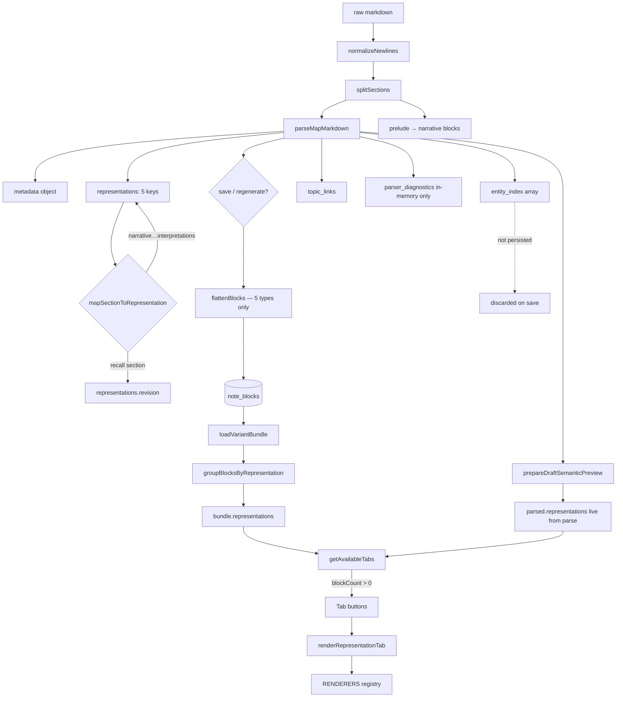

# PrepOS Representation Visibility Orchestration — Architecture Audit

**Scope:** Discovery only. No code changes.

---

## A. Full representation flow

**Two read paths**

| Path | `representations` source | Includes `entity_index`? | Includes `parser_diagnostics`? |
|------|--------------------------|---------------------------|----------------------------------|
| **Draft preview** | Fresh `parseMapMarkdown` | On `parsed`, not in tab map | Yes, parse-only |
| **Published reader** | `groupBlocksByRepresentation(note_blocks)` | No | No |

---

## B. Recognized representations (matrix)

| MSMDF section | Parser bucket | In `representations`? | Renderer | Tab label | Persisted `note_blocks`? | Tab if empty blocks |
|---------------|---------------|------------------------|----------|-----------|--------------------------|---------------------|
| `[METADATA]` | `metadata` | No (top-level) | No | No | No (metadata on `notes` / variant meta) | N/A |
| `[NARRATIVE]` | `narrative` | Yes | `renderNarrative` | Narrative | Yes | Hidden |
| `[STRUCTURAL]` | `structural` | Yes | `renderStructural` | Structural | Yes | Hidden |
| `[REVISION]` | `revision` | Yes | `renderRevision` | Revision | Yes | Hidden |
| `[TIMELINE]` | `timeline` | Yes | `renderTimeline` | Timeline | Yes | Hidden |
| `[INTERPRETATIONS]` | `interpretations` | Yes | `renderInterpretations` | Interpretations | Yes | Hidden |
| `[RECALL]` | **`revision`** (merged) | Yes (same array) | `renderRevision` | **Revision** (no “Recall” tab) | Yes (`source_section: recall` in metadata) | Hidden unless revision array has blocks |
| `[ENTITY_INDEX]` | `entity_index` | **Separate field** | **None** | **None** | **No** | Never tabbed |
| Prelude (pre-section) | `narrative` | Yes (`msmdf_provenance: prelude`) | Same as narrative | Narrative (if blocks) | Yes | Hidden if no narrative blocks |
| `parser_diagnostics` | N/A | Parse result only | No | No | No | N/A |
| `FINAL_VALIDATION` | **Not in codebase** | — | — | — | — | — |

**Why you often see only Narrative + Structural:** Tab visibility is **not** a separate hide-list for Revision/Timeline/etc. Tabs appear only when `representations[key].length > 0`. If those sections are missing or produce zero blocks after `extractBlocks`, those tabs are omitted. That is **content-driven filtering**, not parser failure.

---

## C. Visibility audit (parsed → stored → rendered → hidden)

### Cognition representations (student/reader surface)

| Key | Parsed | Stored | Rendered | Tab | Notes |
|-----|--------|--------|----------|-----|-------|
| `narrative` | Yes | Yes | Yes | If blocks > 0 | Open flow, no collapse |
| `structural` | Yes | Yes | Yes (tree UI) | If blocks > 0 | Different renderer path |
| `revision` | Yes | Yes | Yes | If blocks > 0 | Includes merged `[RECALL]` content |
| `timeline` | Yes | Yes | Yes | If blocks > 0 | Collapsible defaults open |
| `interpretations` | Yes | Yes | Yes | If blocks > 0 | Collapsible, compact mode |

### Semantic / infrastructure (not reader tabs today)

| Artifact | Parsed | Stored | Rendered | UI |
|----------|--------|--------|----------|-----|
| `metadata` | Yes | Partially (note/variant fields) | No tab | Import “Metadata” checklist only |
| `entity_index` | Yes (`parsed.entity_index`) | **No** | **No** | Import checklist only; counts toward save validation |
| `parser_diagnostics` | Yes | No | No | Boundaries used for import tags / `summarizeDetectedSections` |
| `topic_links` / `semantic_candidates` | Yes | `note_topic_links` / anchors | Inline only | Not a representation tab |
| Prelude | Yes → narrative | Yes | Via narrative | No separate tab |

### Recall vs Revision (important)

- Parser: `[RECALL]` → `mapSectionToRepresentation("recall")` → **`revision`** array, with `metadata_json.source_section: recall`.
- Tabs: **no “Recall” tab**; recall lives under **Revision** if any blocks exist in `representations.revision`.
- Import UI: **can** show “✓ Recall” via `summarizeDetectedSections` even when the Revision tab logic only looks at `representations.revision.length`.

---

## D. Exact orchestration points

### Parser (`js/notes/map-parser.js`)

| Symbol | Role |
|--------|------|
| `CANONICAL_BOUNDARY_TAGS` | Section line detection (8 tags) |
| `REPRESENTATION_KEYS` | 5 cognition keys only (no `entity_index`, no `recall` key) |
| `mapSectionToRepresentation()` | `recall` → `revision`; others map 1:1 |
| `parseMapMarkdown()` | Builds `representations`, `entity_index`, `parser_diagnostics` |
| `summarizeDetectedSections()` | Import/diagnostics; **boundary-aware** (can show section with 0 blocks) |

### Storage (`js/notes/note-storage.js`)

| Symbol | Role |
|--------|------|
| `REPRESENTATION_TYPES` | Same 5 keys as parser cognition set |
| `flattenBlocks()` | Only flattens `parsed.representations`; **skips `entity_index`** |
| `validateParsed()` | Block count includes `entity_index` for save gate |

### DB load (`js/notes/note-selectors.js`)

| Symbol | Role |
|--------|------|
| `groupBlocksByRepresentation()` | Rebuilds 5-key object from `note_blocks`; **unknown `representation_type` dropped** |

### Renderer / tabs (`js/notes/note-renderer.js`)

| Symbol | Role |
|--------|------|
| `RENDERERS` | Hardcoded map: 5 keys → render functions |
| `getAvailableTabs()` | **Hardcoded** tab list (5 labels); filter: `(representations[tab.key]?.length ?? 0) > 0` |
| `renderRepresentationTab()` | Dispatches via `RENDERERS[key]` |

### UI consumers

| File | Uses |
|------|------|
| `note-reader.js` | `getAvailableTabs(bundle.representations)` → published DB path |
| `note-draft-editor.js` | `getAvailableTabs(previewParsed.representations)` → live parse path |
| `note-import.js` | `summarizeDetectedSections()` + `SECTION_LABELS` (includes recall, entity_index, prelude) — **not** tab generation |

**There is no single “representation orchestrator” module.** Visibility is **fragmented** across parser constants, storage allowlist, renderer registry, and one filter function.

---

## E. How eligibility works today

Tabs appear when **all** of the following hold:

1. Key is in the **hardcoded** `getAvailableTabs` list (5 cognition keys only).
2. `representations[key].length > 0` after parse or DB regroup.
3. A renderer exists in `RENDERERS` for that key.

**Not used for tabs:** boundary detection, `parser_diagnostics`, `summarizeDetectedSections`, metadata presence, separate recall flag.

**Import vs preview mismatch**

- Import can show “✓ Timeline” because `summarizeDetectedSections` uses `boundaryDetected("TIMELINE")` **or** block count.
- Preview tabs use **block count only**.
- So you can see a section “detected” on import while **no Timeline tab** appears if the section body parsed to zero blocks.

---

## F. Existing infrastructure for hidden / auxiliary reps?

| Concept | Exists? | How |
|---------|---------|-----|
| Hidden representations | **Implicit only** | `entity_index` + `parser_diagnostics` on parse object; no registry |
| Auxiliary representations | **Partial** | `entity_index` separate array; not wired to UI |
| Semantic-only (governance) | **Separate pipeline** | Anchors/preview; not representation tabs |
| Governance-only | **N/A** at representation layer | Inspector/governance on draft preview |
| Recall as distinct surface | **No** | Merged into `revision` bucket |
| Config-driven tab policy | **No** | Hardcoded arrays in 3 places |

**Cognition vs infrastructure separation:** **Conceptually started** (entity_index split, diagnostics), but **not formalized** — no `RepresentationRole`, no orchestrator, no visibility policy object.

---

## G. Assessment

### Strengths

- Clear 5-representation cognition model in parser + renderer + storage (aligned keys).
- Structural vs narrative rendering strategies differ (good cognitive roles).
- MSMDF v1.2 boundaries and prelude handling are parser-complete.
- Draft preview uses live parse; published uses persisted blocks (consistent shape).

### Weaknesses

- **Triple hardcoding:** `REPRESENTATION_KEYS`, `REPRESENTATION_TYPES`, `getAvailableTabs` / `RENDERERS` must be edited in sync.
- **No orchestration layer:** visibility = accidental composition of filter + allowlists.
- **`entity_index` loss on save:** parsed and validated, never persisted or rendered.
- **Recall folded into Revision** without UI distinction; import suggests Recall is its own section.
- **Detection vs visibility divergence:** `summarizeDetectedSections` ≠ tab eligibility.
- **Published vs draft:** same tab logic, different `representations` sources (can confuse debugging).
- **`FINAL_VALIDATION`:** not implemented; unknown tags only get `parser_diagnostics.warnings`.

### Verdict

PrepOS has **partial representation rendering**, not **true representation orchestration**. The parser is multi-representation; the **visibility layer is a thin, hardcoded, block-count gate** on five keys. Auxiliary sections are **parsed and partially surfaced in import**, not **orchestrated** for reading UX.

---

## H. Recommendations (no implementation)

1. **Introduce a representation registry** (single source of truth), e.g. per key: `{ id, msmdfTag, role: 'cognition' | 'infrastructure', tabLabel?, persist, renderFn?, tabPolicy: 'blocks' | 'never' | 'boundary' }`.
2. **Unify detection and tab eligibility** — either tabs use the same rules as import summary, or import stops implying tabs will exist when only a boundary was detected.
3. **Decide recall policy** — separate tab, Revision sub-badge, or filter Revision tab content by `source_section` with two sub-views.
4. **Persist or drop `entity_index` explicitly** — if infrastructure: store in `note_blocks` with `representation_type: entity_index` or a dedicated table; if never reader-visible, document and remove from save validation confusion.
5. **Keep `parser_diagnostics` parse-only** but expose in teacher tooling (not student tabs).
6. **Add `FINAL_VALIDATION` (if required by MSMDF)** to boundary tags with `role: infrastructure`, not cognition tabs.
7. **Centralize `getAvailableTabs`** to read from registry + policy instead of duplicating the five-key array.
8. **Document the two pipelines** in one diagram for contributors: Parse → Persist → Load → Tab filter → Render.

---

## Direct answers to primary questions

| Question | Answer |
|----------|--------|
| **A. Parse output structure** | `{ metadata, representations{5}, entity_index[], topic_links, parser_diagnostics, source, variant, canonical_note }` |
| **B. What becomes tabs?** | Only keys in `getAvailableTabs` with **non-empty block arrays** — max 5 tabs, never Recall/Entity Index |
| **C. Where filtered?** | **`getAvailableTabs` in `note-renderer.js`** (block count); parser pre-filters via section mapping; storage drops non-five types on load |
| **D. ENTITY_INDEX etc.** | Parsed → `entity_index`; **not stored, not rendered, not tabbed**; diagnostics **in-memory**; metadata **not tabbed** |
| **E. Eligibility** | Hardcoded allowlist + `length > 0` (not dynamic from parse boundaries alone) |
| **F. Hidden/infra infrastructure** | Partial ad hoc split only; **no formal orchestration** |

